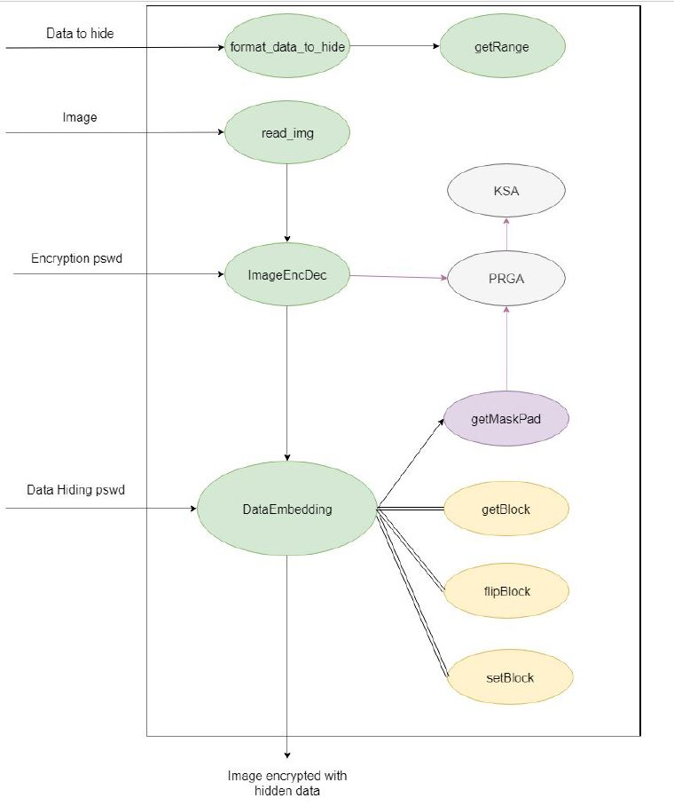
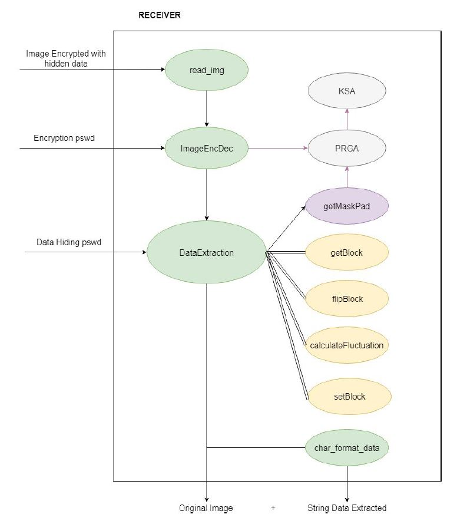

# Reversible Data Hiding in Encrypted Image

A simple Matlab implementation of the algorithm presented in the paper: "Reversible-data-hiding-in-Encrypted-image" (Xinpeng Zhang)

link: http://pgembeddedsystems.com/download/matlab/Reversible%20Data%20Hiding%20in%20Encrypted%20Image.pdf

In this implementation two Stream Ciphers were used:
-Trivium
-RC4

Implemented features:
1. Image upload and grayscale conversion (two-dimensional image with 8-bit depth);
2. Conversion of data to hide in bit string;
3. Calculation of the possible lengths of the bit string to be inserted;
4. Encryption (and decryption) of the image with RC4 stream cipher;
5. Parallelization of streamciphers (RC4 and Trivium) [Requirements: 'parallel computing toolbox'];
6. Encryption (and decryption) of the image with Trivium (not recommended);
7. Parallelization of Trivium (not recommended);
8. Entering data to hide:
to. extraction of the block (i, j) of size s;
b. flip of the block based on the bit to be inserted and based on the pseudo-random division defined by the stream cipher (RC4 or Trivium);
9. Extraction of data and original image;
10. Conversion of the string of bits inserted into character string.

Sender flow:

Receiver flow:

